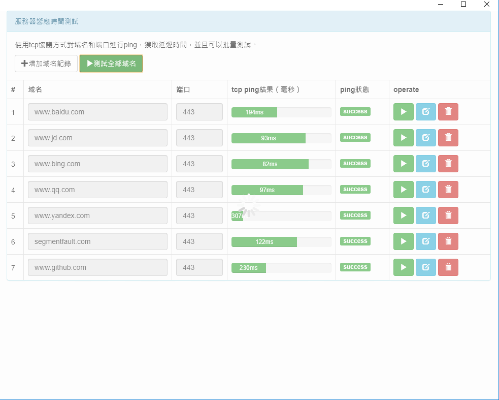

# chrome-ping-app

### Introduction
```
    The traditional ICMP method pings the domain name. For network security and other factors, most network environments and cloud environments may prohibit ICMP. The TCP method is used to imitate the real client connection and measure the TCP round-trip time.
    chrome-ping-app is an app plug-in for chrome browser; use tcp method to detect the delay time of domain name / ip, use the progress bar to display the speed; enter the domain name in chrome-ping-app will be remote Synchronization can also be displayed in the chrome browser of other computers.
```

[中文](./README_zh_cn.md) | [English](./README.md)

### Show results



