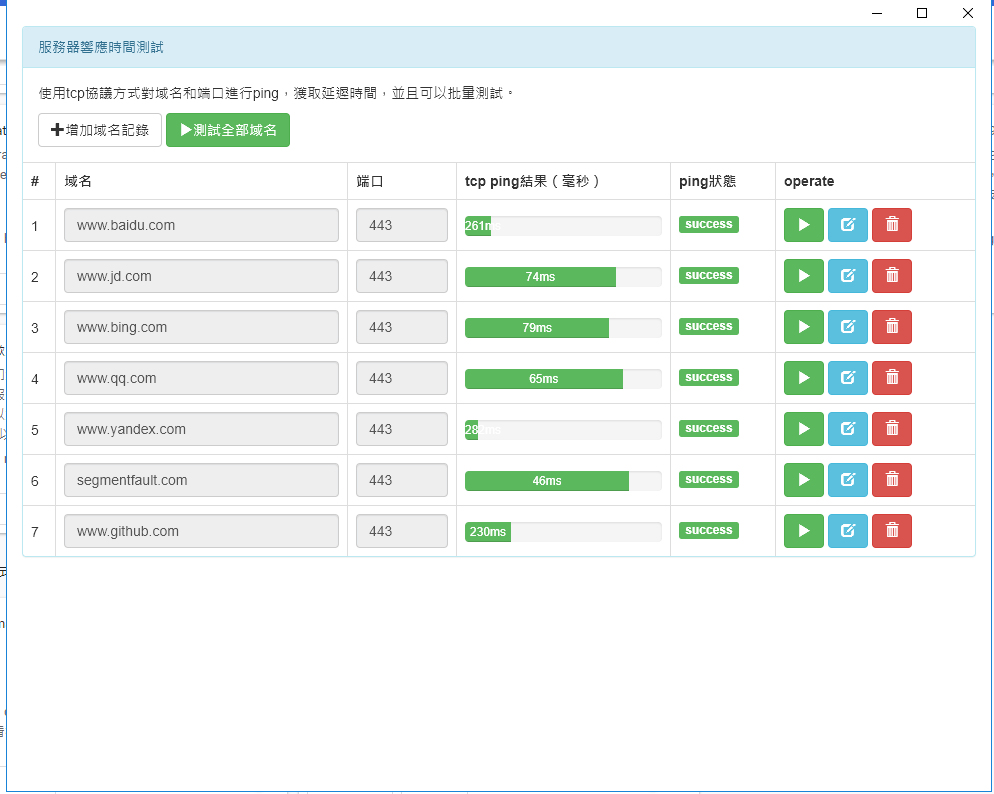
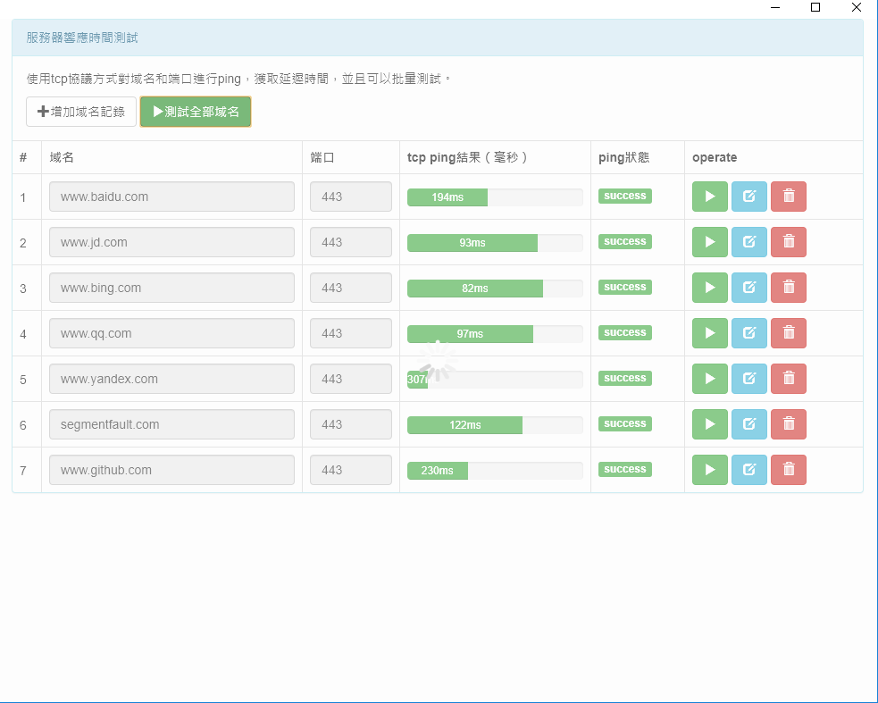

# chrome-ping-app

### 简介

传统的ICMP方式ping检测域名，出于网络安全等因素，大部分网络环境以及云环境可能都会禁止 ICMP，使用TCP方式仿制客户端真实连接，测量TCP往返时间。

chrome-ping-app是一个chrome浏览器的app插件；使用tcp方式对域名/ip进行检测延迟时间，使用进度条的方式显示速度快慢;在chrome-ping-app内输入域名会根据chrome用户进行远程同步，在其他计算机的chrome浏览器也可以显示。

[中文](./README_zh_cn.md) | [English](./README.md)

### 效果展示

